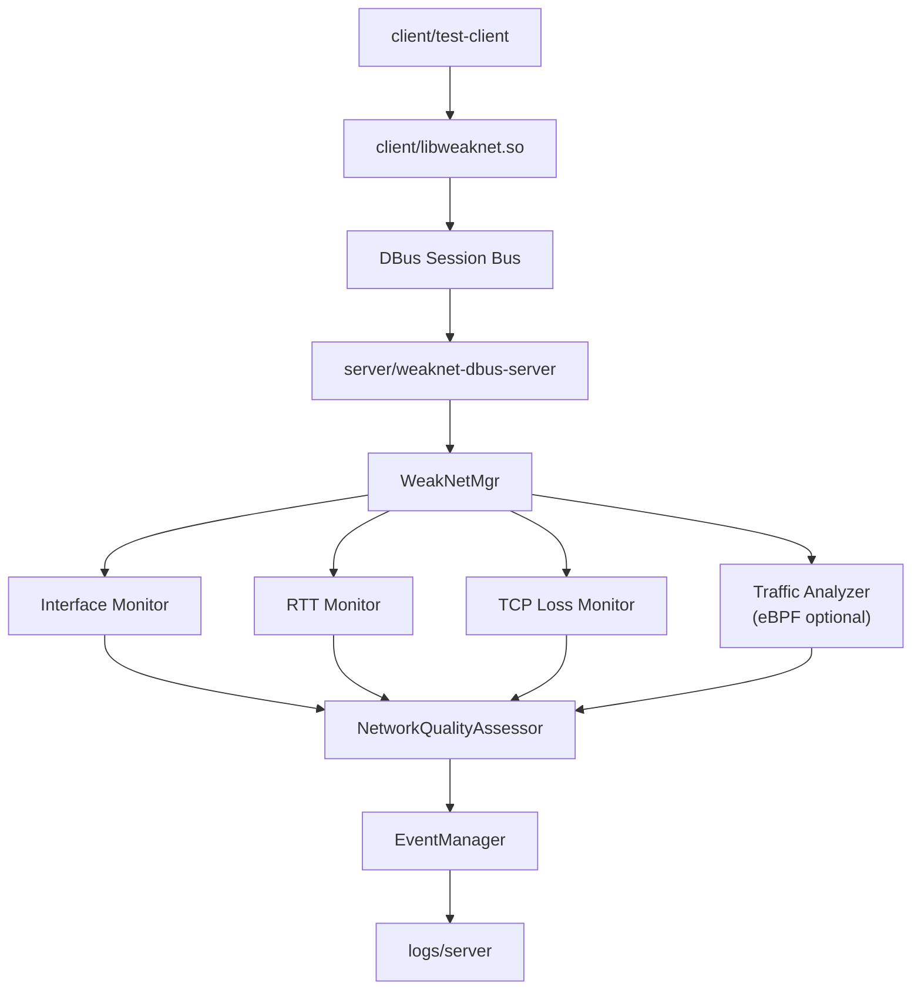
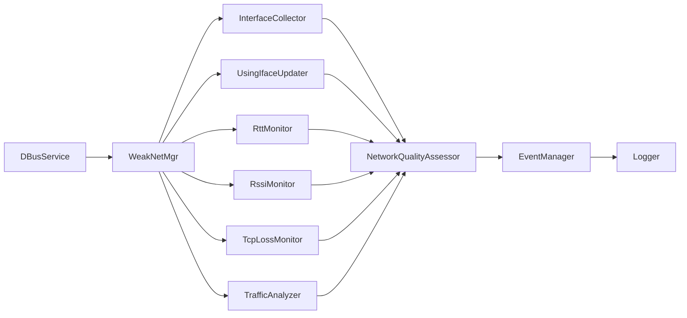
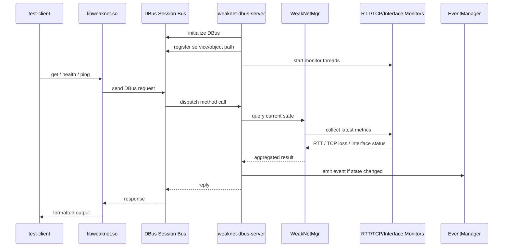

# WeakNet AI Diagnostics

## 项目简介

WeakNet AI Diagnostics 是一个面向 Linux 环境的网络诊断与弱网监控系统，核心链路由 C++、DBus 和 Linux 网络监控模块组成，并提供实验性日志分析工具用于辅助排查网络异常。

当前仓库标识为 `WeakNet-AI-Diagnostics`，整理为首次公开发布版本。项目重点保留已经完成部署验证的服务端、客户端、DBus 通信、网卡检测、健康检查和 Ping 功能。

## 功能特性

- Linux 网络接口检测
- 当前默认上网网卡识别
- RTT 延迟监控
- TCP 丢包率监控
- 网络质量评分
- 网络状态事件管理
- DBus 服务端接口
- C/C++ 客户端动态库
- `test-client` 命令行测试工具
- eBPF 流量分析模块，该模块依赖内核权限、BTF、libbpf 和实际运行环境

## 系统架构

- `server/`：DBus 服务端和网络监控核心逻辑，包括网卡检测、RTT、TCP 丢包率、Ping、事件管理、质量评分和 eBPF 流量分析。
- `client/`：客户端动态库、C/C++ 调用接口和 `test-client` 测试程序。
- `logs/`：运行日志目录和日志配置。
- `docs/`：部署、验证和功能说明文档。
- `optional/experimental/`：实验性分析工具，不属于核心运行链路。

## 架构图

### 1. 整体架构图



客户端通过 `libweaknet.so` 封装 DBus 调用，与服务端 `weaknet-dbus-server` 通信。服务端内部由 `WeakNetMgr` 统一协调各监控模块，并将状态变化交由 `EventManager` 处理和记录。

### 2. 服务端模块关系图



服务端以 `WeakNetMgr` 为核心协调模块，统一维护网络接口状态、监控结果和统计信息。`DBusService` 提供对外调用入口，`NetworkQualityAssessor` 负责根据监控结果生成综合网络质量判断。

### 3. 运行调用流程图



项目运行时，服务端首先初始化 DBus 并启动多个后台监控线程。客户端通过 `libweaknet.so` 调用 DBus 方法，服务端再通过 `WeakNetMgr` 汇总实时状态并将结果返回。

## 目录结构

```text
.
├── Makefile
├── config.mk
├── install.sh
├── README.md
├── client/
│   ├── README_CLIENT.md
│   ├── README_LIBRARY.md
│   ├── bin/                    # generated after build
│   ├── lib/                    # generated after build
│   ├── client.cpp
│   ├── test_client.cpp
│   ├── test_network_quality.cpp
│   ├── example_usage.cpp
│   ├── ping_example.cpp
│   └── weaknet_client.h
├── docs/
│   ├── events.md
│   ├── path-portability.md
│   ├── ping-feature.md
│   ├── project-notes.md
│   └── test-client-validation.md
├── logs/
│   ├── config/
│   └── server/
├── optional/
│   └── experimental/
│       └── log-analysis-tools/
└── server/
    ├── Makefile
    ├── bin/                    # generated after build
    ├── build/                  # generated after build
    ├── include/
    ├── src/
    └── vmlinux.h               # generated from kernel BTF
```

## 运行环境

已验证环境：

- Alibaba Cloud Linux 3.2104 U11
- Kernel: `5.10.134-18.al8.x86_64`
- Network interface: `eth0`
- `gcc` / `g++`
- `clang` / `llvm`
- `dbus`
- `glog`
- `libbpf`
- `bpftool`

## 编译依赖

Alibaba Cloud Linux / RHEL 系环境可使用 `dnf` 安装依赖：

```bash
dnf groupinstall -y "Development Tools"
dnf install -y gcc gcc-c++ make cmake clang llvm pkgconf pkgconf-pkg-config pkgconfig dbus dbus-devel dbus-x11 glog glog-devel elfutils-libelf elfutils-libelf-devel zlib zlib-devel libcap libcap-devel kernel-headers kernel-devel libbpf libbpf-devel bpftool
```

## 编译步骤

1. 生成 `server/vmlinux.h`：

```bash
bpftool btf dump file /sys/kernel/btf/vmlinux format c > server/vmlinux.h
```

2. 清理旧构建产物：

```bash
make clean
```

3. 编译服务端、客户端动态库和测试工具：

```bash
make all
```

编译完成后主要产物包括：

- `server/bin/weaknet-dbus-server`
- `server/build/flow_rate.bpf.o`
- `client/lib/libweaknet.so`
- `client/bin/test-client`

## 部署验证

当前验证流程使用 DBus Session Bus，适合本地部署验证和开发调试：

```bash
dbus-run-session -- bash

cd <project-root>

./server/bin/weaknet-dbus-server > weaknet-server.log 2>&1 &
SERVER_PID=$!

sleep 5

LD_LIBRARY_PATH=./client/lib:$LD_LIBRARY_PATH ./client/bin/test-client get
LD_LIBRARY_PATH=./client/lib:$LD_LIBRARY_PATH ./client/bin/test-client health
LD_LIBRARY_PATH=./client/lib:$LD_LIBRARY_PATH ./client/bin/test-client ping 223.5.5.5
```

验证结束后可停止服务端：

```bash
kill "$SERVER_PID"
```

## 已验证结果

- `get` 返回：`eth0`
- `health` 返回：包含 `interface`、`quality_score`、`rtt_ms`、`tcp_loss_rate`、`traffic_bps` 等字段的 JSON
- `ping` 返回：`PING 223.5.5.5 via eth0: 约 5ms`

## 已知限制

- 当前默认使用 DBus Session Bus，适合部署验证和开发调试；生产环境建议改为 System Bus 或增加 systemd 管理。
- 阿里云 ECS 没有 Wi-Fi，RSSI 字段可能显示默认值，不影响有线网卡场景下的基础诊断。
- eBPF 流量分析模块依赖内核权限、BTF、libbpf 和运行时安全策略，在部分云服务器环境可能进入 degraded mode。
- 当前项目验证重点是服务端、客户端、DBus 通信、网卡检测、健康检查和 Ping 功能。
