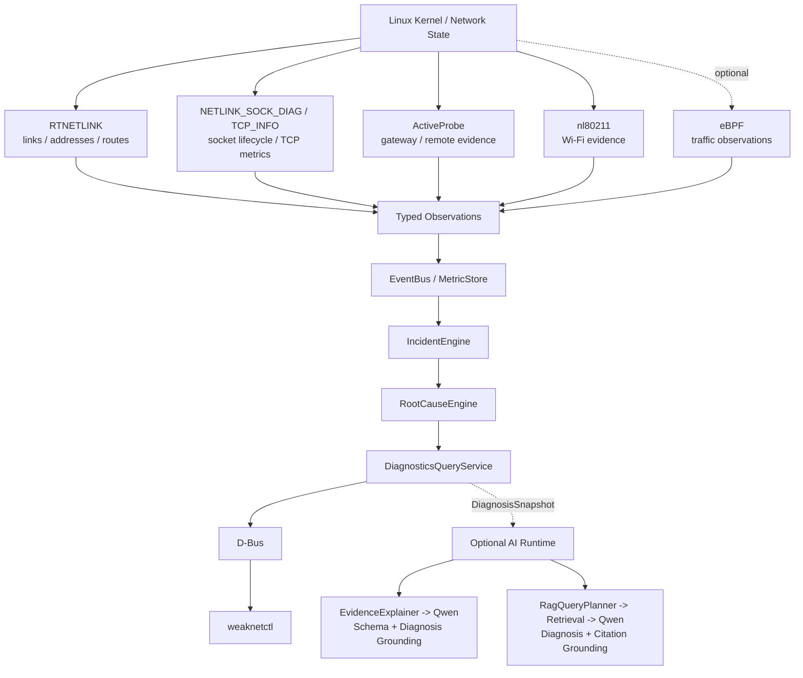

# WeakNet AI Diagnostics

WeakNet AI Diagnostics 是一个 Linux 原生的网络可观测与证据驱动诊断系统。它从内核和网络协议栈采集拓扑、socket、TCP、主动探测、Wi-Fi 与可选 eBPF 观测，将数据规范化为带作用域、有效性、时间和来源的证据，再由确定性的 C++ `IncidentEngine` 与 `RootCauseEngine` 生成可解释诊断。可选的 Qwen explanation 与 RAG troubleshooting advice 位于诊断链路下游，只解释或引用已有结果，不改变诊断权威。

## 项目解决什么问题

传统监控通常能够显示 RTT、重传计数、接口状态或 RSSI，却不一定区分以下状态：

- 指标值确实为零，还是根本没有数据；
- telemetry 不可用，还是网络健康；
- 已观测到异常条件，还是已经确定根因；
- 证据不足，还是存在反证；
- 检索到的运维知识，还是当前机器上真实观测到的网络证据。

WeakNet 将这些边界编码进类型和诊断规则。每个事件、指标、incident 和根因假设都携带明确的身份、作用域、时间、有效性和 provenance；缺失或降级的采集能力不会被静默转换为“正常”。

完整数据流如下：

1. 从 Linux kernel/network state 收集结构化观测。
2. `EventBus` 负责有界事件传递，`MetricStore` 保存有界快照和时间窗口。
3. `IncidentEngine` 检测可观测的异常条件。
4. `RootCauseEngine` 组合 Supporting、Contradicting、Missing evidence，生成保守的根因假设。
5. `DiagnosticsQueryService` 通过 D-Bus 和 `weaknetctl` 暴露确定性结果。
6. 可选 `EvidenceExplainer` 使用 Qwen 解释 `DiagnosisSnapshot`。
7. 可选 RAG Advisor 检索运维知识并输出带稳定引用的检查建议。
8. Schema、diagnosis grounding 与 citation grounding 阻止模型提升诊断权限或伪造引用。

## 系统架构


```mermaid
flowchart TB
    K["Linux Kernel / Network State"]
    K --> RT["RTNETLINK<br/>links / addresses / routes"]
    K --> SD["NETLINK_SOCK_DIAG / TCP_INFO<br/>socket lifecycle / TCP metrics"]
    K --> AP["ActiveProbe<br/>gateway / remote evidence"]
    K --> WF["nl80211<br/>Wi-Fi evidence"]
    K -. optional .-> EB["eBPF<br/>traffic observations"]

    RT --> OBS["Typed Observations"]
    SD --> OBS
    AP --> OBS
    WF --> OBS
    EB --> OBS

    OBS --> BUS["EventBus / MetricStore"]
    BUS --> IE["IncidentEngine"]
    IE --> RC["RootCauseEngine"]
    RC --> QS["DiagnosticsQueryService"]
    QS --> DB["D-Bus"]
    DB --> CLI["weaknetctl"]

    QS -. DiagnosisSnapshot .-> AI["Optional AI Runtime"]
    AI --> EX["EvidenceExplainer -> Qwen<br/>Schema + Diagnosis Grounding"]
    AI --> RAG["RagQueryPlanner -> Retrieval -> Qwen<br/>Diagnosis + Citation Grounding"]
```

确定性 C++ 诊断是系统的 authority。Python、外部模型、向量索引或 Internet 均不是核心诊断的运行依赖。

## 数据采集与证据

### RTNETLINK

`NetlinkCollector` 读取并订阅 link、address 和 route 状态，维护带 network namespace 身份的拓扑快照，并根据建模路由选择 uplink。Dump 只有在 sequence、sender、multipart completion、长度和错误状态都有效时才会原子提交；失败或竞争条件不会把不完整拓扑当作权威结果。

路由归因是可解释的 modeled route，不等同于完整 Linux RPDB、fwmark、source policy、VRF 或 ECMP flow hashing。

### NETLINK_SOCK_DIAG 与 TCP_INFO

`SocketTracker` 通过 `NETLINK_SOCK_DIAG` 枚举 IPv4/IPv6 TCP socket，并从可用的 `TCP_INFO` 字段计算 RTT、吞吐与重传 interval metrics。socket identity 包含 namespace、cookie（可用时）和 generation；相同四元组不代表同一个 socket 生命周期。

只有同一 generation、时间递增且 counter 字段兼容的样本才能计算 delta。counter 回退会重置 baseline，而不是生成负值或零流量。

**TCP retransmission != packet loss。** `delta_total_retrans / delta_data_segs_out` 是重传 segment ratio；它不是权威 packet-loss rate，分母不可用或为零时结果保持 unavailable。

### ActiveProbe

`ActiveProbe` 对建模网关和配置的 numeric IPv4 remote target 执行有界 ICMP datagram probe，提供 reachability 与 RTT 证据。一次 timeout 只是一次观测，不是丢包百分比，也不能单独证明本地链路、ISP 或远端服务故障。

### nl80211

`WifiCollector` 通过 Generic Netlink/nl80211 获取当前接口的 association、signal、bitrate 与可选 counters。`NotWifi`、`Unsupported`、`PermissionDenied`、stale 或缺失属性会保持显式状态。低 RSSI 与累计 retry counter 是上下文，不是干扰、AP 故障或 packet loss 的直接证明。

### eBPF

eBPF 流量观测是可选能力。构建、加载、attach、BTF 或权限不足时，daemon 以可见的 degraded capability 继续运行，不会把缺失流量证据报告为健康值。

## 确定性诊断

```text
Observation -> Incident -> RootCauseHypothesis
```

`IncidentEngine` 检测“已经观测到什么异常”，不推断原因。它使用作用域、socket generation、连续样本和 recovery hysteresis 管理 incident 生命周期。

| Incident | 含义 |
| --- | --- |
| `HighTcpRtt` | 某个 socket 的 TCP-estimated RTT 持续超过阈值 |
| `ElevatedTcpRetransmission` | 有效发送区间内重传 segment ratio 持续升高 |
| `RouteUnavailable` | 权威 modeled topology 对 socket 目的地没有可用路由 |
| `SocketRouteConflict` | `diag_ifindex` 与 modeled route interface 明确冲突 |
| `UplinkUnavailable` | 权威拓扑中没有选中的可用 uplink |

`RootCauseEngine` 在 active incidents 基础上组合拓扑、probe 与 Wi-Fi context，生成证据支持的 hypothesis，而不是绝对因果结论。

| Root-cause hypothesis | 含义 |
| --- | --- |
| `UplinkAvailabilityProblem` | 权威 uplink 状态不可用 |
| `LocalRoutingProblem` | 路由不存在或 socket-route 明确冲突 |
| `NetworkPathDegradation` | socket path 出现 RTT/重传退化 |
| `RemoteOrUpstreamDegradation` | 本地网关正常，而更远目标出现退化迹象 |
| `LocalLinkSuspected` | path incident 与当前 Wi-Fi association/signal 证据相关 |
| `InsufficientEvidence` | incident 存在，但必要上下文缺失或过期 |

每个 hypothesis 分离三类 evidence：

- `Supporting`：与当前假设一致的观测；
- `Contradicting`：削弱当前假设的观测；
- `Missing`：需要但不可用、过期或不适用的证据。

Confidence 为确定性规则产生的 `Low`、`Medium` 或 `High`，不是概率。`suspected` 不会被写成 `confirmed`；例如 `RemoteOrUpstreamDegradation` 只表示退化迹象可能位于 immediate gateway 之外，不等同于确认 ISP 或远端服务器故障。

## 核心语义边界

```text
unknown != zero
unavailable != healthy
partial != authoritative
counter reset != zero traffic
retransmission != packet loss
same tuple != same socket
modeled route != guaranteed kernel route
incident != root cause
missing evidence != supporting evidence
missing evidence != contradiction
retrieved knowledge != observed evidence
AI/RAG unavailable != diagnosis unavailable
suspected != confirmed
```

这些规则同时约束 collector、diagnosis、D-Bus serialization、CLI 与 AI 输出，避免在数据不完整时制造虚假的确定性。

## AI 与 RAG

### `diagnose --explain`

```bash
weaknetctl diagnose --explain
```

`EvidenceExplainer` 接收结构化 `DiagnosisSnapshot`，调用可替换的 `LlmProvider`（真实 DashScope/Qwen 或测试用 fake provider），并返回 `ExplanationReport`。模型只能生成说明文本和引用现有 hypothesis/evidence ID，不能修改 root-cause type、confidence、state、scope 或 `EvidenceRole`。

### `diagnose --advise`

```text
DiagnosisSnapshot
  -> RagQueryPlanner
  -> BM25
  -> optional BGE / FAISS
  -> RRF
  -> optional reranker
  -> RetrievalBundle
  -> Qwen
  -> Diagnosis Grounding
  -> Citation Grounding
```

RAG Advisor 提供 evidence-aware troubleshooting suggestions。语料由 `ai/knowledge/manifest.json` allowlist 管理；每个 chunk 具有稳定的 document/chunk/version identity。建议中的知识性说明和检查项必须引用当前 `RetrievalBundle` 内的精确 citation。

BM25 lexical retrieval 始终可用。BGE、FAISS 与 reranker 是 lazy、可选能力；普通启动不会自动下载模型。真实 lexical BM25 + Qwen advisor 已做 live validation；真实 BGE/reranker hybrid 执行仍取决于本地模型权重与兼容环境。

检索到的知识不是当前网络观测。系统不会把知识库内容升级为 Supporting evidence，也没有 autonomous agent、shell execution 或自动 remediation。

## 为什么 AI 不会替代确定性诊断

- C++ `IncidentEngine` 与 `RootCauseEngine` 输出始终是 authority。
- Provider output 必须通过固定 schema，未知字段和权威诊断字段会被拒绝。
- `GroundingValidator` 校验 hypothesis/evidence ID、角色、作用域和 missing-evidence 限制，防止 authority escalation。
- `CitationGroundingValidator` 要求建议只能引用本次检索 bundle 内的稳定 citation，防止伪造来源。
- 最终 report 从 `DiagnosisSnapshot` 复制 root cause、confidence 和 evidence roles，而不是相信模型文本。
- AI service、provider 或 retrieval 失败会单独报告，不会删除确定性诊断或改变其退出码。

## 验证与评估

系统回归验证与 AI/RAG 评估衡量不同对象：前者验证确定性诊断、接口和 Lab 框架，后者验证检索与模型输出边界。

| 验证项 | 结果 |
| --- | --- |
| C++ CTest | 31 个登记测试，30 个执行通过、0 失败；1 个 network-namespace integration test 因 host capability 跳过 |
| Python AI/RAG tests | 65 个测试用例，62 个执行通过；3 个 opt-in live-provider tests 跳过 |
| WeakNet Lab tests | 16 个测试用例，15 个离线测试通过；1 个 privileged integration test 跳过 |
| RAG retrieval evaluation | 8 个本地诊断检索 case |
| BM25 | Recall@1 `0.750` · Recall@3 `1.000` · Recall@5 `1.000` · MRR `0.875` |
| 已记录的真实 Qwen Advisor 验证 | 3 / 3 个语义场景通过：`LocalLinkSuspected`、`RemoteOrUpstreamDegradation`、`InsufficientEvidence` |

BM25 指标来自项目内置的 8-case 小型诊断检索集，只用于回归与架构验证，不代表通用网络诊断准确率。真实 Qwen Advisor 验证仅覆盖上述 3 个语义场景；在这些场景中 schema、diagnosis grounding 与 citation grounding 均通过当前 validator，非法引用和未引用知识声明均为 0，但这不表示普遍的“100% AI 准确率”。真实 BGE-M3/reranker Hybrid-RAG 仍受本地模型权重和运行环境限制，因此项目不声明 Hybrid-RAG live benchmark。

## 使用方式

### 构建与测试

不启用 eBPF 的构建最容易复现：

```bash
cmake -S . -B build/no-ebpf -G Ninja \
  -DCMAKE_BUILD_TYPE=RelWithDebInfo \
  -DENABLE_EBPF=OFF \
  -DBUILD_TESTING=ON
cmake --build build/no-ebpf --parallel
ctest --test-dir build/no-ebpf --output-on-failure
```

启用 eBPF 需要 Clang BPF backend、libbpf/libelf/zlib、kernel BTF 或预生成 `vmlinux.h`，以及相应运行权限。详细选项见 [构建与测试](docs/BUILDING.md)。

### 启动确定性诊断

当前服务使用 session D-Bus。进入一个 session-bus shell：

```bash
dbus-run-session -- bash
```

在该 shell 中启动 server：

```bash
./build/no-ebpf/bin/weaknet-dbus-server
```

在继承同一 `DBUS_SESSION_BUS_ADDRESS` 的终端中运行：

```bash
./build/no-ebpf/bin/weaknetctl status
./build/no-ebpf/bin/weaknetctl incidents
./build/no-ebpf/bin/weaknetctl hypotheses
./build/no-ebpf/bin/weaknetctl diagnose
```

`status` 返回总体状态、topology authority、collector degradation、uplink、active incidents 和 hypotheses。`diagnose` 输出结构化的确定性状态、incident、root-cause hypothesis 和 evidence summary。

## 可选 AI 服务

```bash
python3 -m venv .venv
.venv/bin/pip install -r ai/requirements-runtime.txt

WEAKNET_LLM_PROVIDER=dashscope \
WEAKNET_LLM_MODEL="<model>" \
DASHSCOPE_API_KEY="<your-key>" \
.venv/bin/python -m ai.v2.runtime
```

然后运行：

```bash
./build/no-ebpf/bin/weaknetctl diagnose --explain
./build/no-ebpf/bin/weaknetctl diagnose --advise
```

AI runtime 默认只监听 `127.0.0.1:8765`。缺少 key、provider timeout、invalid schema、grounding violation 或 retrieval failure 都会作为独立错误显示。

## WeakNet Lab

WeakNet Lab 在自己创建的 network namespace、veth 和 qdisc 中运行真实 daemon 与本地 workload，用 `tc/netem` 注入有界故障，再从 D-Bus 读取诊断并生成结构化 evaluation artifact。它不会向 engine 注入 incident 或 hypothesis。

```bash
export WEAKNET_LAB_BUILD_DIR=build/no-ebpf
./lab/weaknet-lab doctor
./lab/weaknet-lab list
```

主要场景：

- `healthy`：本地 TCP 流量，无注入故障；
- `high-rtt`：持续 RTT degradation；
- `retransmission`：netem loss 触发重传证据；
- `uplink-unavailable`：仅移除 lab namespace 的默认路由；
- `observability-gap`：可选 telemetry 不可用。

缺少 network namespace 或 capability 时，场景写入明确的 `SKIP`，不会修改 host network。`fixture-demo` 是明确标记的 `SIMULATION`，不代表真实 kernel telemetry。

## 项目结构

```text
server/       C++ daemon、collectors、stores 与 diagnosis engines
client/       weaknetctl、C compatibility library 与示例
ai/v2/        可选 explanation / grounded RAG runtime
ai/knowledge/ allowlisted runtime knowledge corpus
lab/          隔离场景与 evaluation harness
tests/        C++ unit、integration 与 contract tests
docs/         当前架构、诊断、接口、AI/RAG、构建文档
```

## 已知限制

- 当前运行和测试路径使用 session D-Bus，尚未提供完整 system-bus/systemd production packaging。
- modeled route attribution 不覆盖完整 RPDB、fwmark、source policy、VRF 和 ECMP flow hashing。
- ActiveProbe 当前使用 numeric IPv4 target，不提供 DNS、traceroute、jitter 或 packet-loss window。
- namespace、eBPF 与 physical Wi-Fi 验证取决于 host capability、kernel/BTF 和实际设备。
- dense BGE/FAISS/reranker live validation 需要可用的本地模型权重与兼容 runtime。
- AI 依赖外部 provider 或本地模型，但始终是可选层。

## 进一步阅读

- [系统架构](docs/ARCHITECTURE.md)
- [诊断模型](docs/DIAGNOSIS.md)
- [接口与命令行](docs/API_AND_CLI.md)
- [AI 与 RAG](docs/AI_AND_RAG.md)
- [构建与测试](docs/BUILDING.md)
