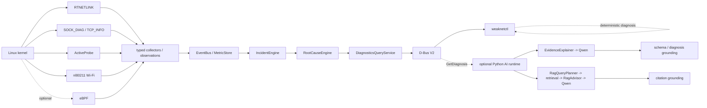

# WeakNet AI Diagnostics

WeakNet AI Diagnostics 是一个 Linux 原生的网络可观测与证据驱动诊断系统。它从内核和网络协议栈收集有边界、带有效性和来源信息的观测，先由确定性的 C++ 引擎生成事件、事件状态和根因假设，再通过 D-Bus V2 与 `weaknetctl` 提供查询。可选的 Python AI/RAG 服务只解释已有证据或给出带稳定引用的下一步检查，不改变确定性诊断。

## 核心能力

- 通过 RTNETLINK 建模链路、地址、路由和 uplink 拓扑。
- 通过 `NETLINK_SOCK_DIAG` 与 `TCP_INFO` 跟踪 TCP socket 生命周期和有效字段；计数器重置、缺失字段和 socket generation 会被显式处理。
- 将 socket 与已建模路由进行可解释的 route attribution，并保留歧义和权威性边界。
- `ActiveProbe` 对建模网关和配置的 IPv4 目标提供受限的主动证据。
- 通过原生 `nl80211` 获取 Wi-Fi 关联、信号和速率证据。
- 可选 eBPF 流量观测，能力不足时进入可见的 degraded 状态。
- `EventBus` / `MetricStore` 提供有界的事件传递和快照存储。
- `IncidentEngine` 检测可观测条件，`RootCauseEngine` 根据 Supporting、Contradicting、Missing 证据生成根因假设。
- D-Bus V2 只读诊断接口与 `weaknetctl` 命令行客户端。
- 可选 Qwen/DashScope `EvidenceExplainer`，以及带引用的 RAG Advisor。
- WeakNet Lab：隔离 network namespace、`tc/netem` 场景和结构化评估结果。

核心诊断不依赖 Python、模型服务或 Internet。AI 服务不可用时，确定性诊断仍然可用。

## 设计原则

这些语义是对数据和诊断边界的约束，而不是提示词或操作指令：

```text
unknown != zero                 unavailable != healthy
partial != authoritative        counter reset != zero traffic
retransmission != packet loss   same tuple != same socket
modeled route != guaranteed kernel route
incident != root cause          suspected != confirmed
missing evidence != supporting evidence
missing evidence != contradiction
retrieved knowledge != observed evidence
AI/RAG unavailable != diagnosis unavailable
```

TCP 重传派生指标不能被称为权威的 packet-loss rate。旧 V1 接口中保留的字段名只表示兼容性，不改变这一语义。

## 系统架构


```mermaid
flowchart LR
    K["Linux kernel"] --> N["RTNETLINK"]
    K --> S["SOCK_DIAG / TCP_INFO"]
    K --> P["ActiveProbe"]
    K --> W["nl80211 Wi-Fi"]
    K -. optional .-> B["eBPF"]
    N --> C["typed collectors / observations"]
    S --> C
    P --> C
    W --> C
    B --> C
    C --> E["EventBus / MetricStore"]
    E --> I["IncidentEngine"]
    I --> R["RootCauseEngine"]
    R --> Q["DiagnosticsQueryService"]
    Q --> D["D-Bus V2"]
    D --> CLI["weaknetctl"]
    CLI -. deterministic diagnosis .-> CLI
    D -. GetDiagnosis .-> X["optional Python AI runtime"]
    X --> EX["EvidenceExplainer -> Qwen"]
    X --> RA["RagQueryPlanner -> retrieval -> RagAdvisor -> Qwen"]
    EX --> G["schema / diagnosis grounding"]
    RA --> CG["citation grounding"]
```

`IncidentEngine` 和 `RootCauseEngine` 是两个不同的确定性边界。典型 incident 包括 `HighTcpRtt`、`ElevatedTcpRetransmission`、`RouteUnavailable`、`UplinkUnavailable` 和 `SocketRouteConflict`。根因假设包括 `UplinkAvailabilityProblem`、`LocalRoutingProblem`、`NetworkPathDegradation`、`RemoteOrUpstreamDegradation`、`LocalLinkSuspected` 和 `InsufficientEvidence`。引擎分别保留 Supporting、Contradicting、Missing evidence；缺失能力不会被当作反证或健康。

当前 D-Bus 使用 session bus，服务名为 `com.example.WeakNet`，V2 对象为 `/com/example/WeakNet/V2`，接口为 `com.example.WeakNet.Diagnostics2`。V1 兼容对象仍保留，但不是当前架构的主路径。详见 [`docs/V2_ARCHITECTURE.md`](docs/V2_ARCHITECTURE.md) 与 [`docs/V2_API_AND_CLI.md`](docs/V2_API_AND_CLI.md)。

## AI 与 RAG

AI 是下游、可选的解释层：

- `weaknetctl diagnose --explain` 解释 C++ 返回的 `DiagnosisSnapshot`；模型不能修改 root-cause type、confidence、状态或证据角色。
- `weaknetctl diagnose --advise` 使用 `DiagnosisSnapshot -> RagQueryPlanner -> BM25 -> 可选 BGE/FAISS -> RRF -> 可选 reranker -> RetrievalBundle -> grounded advisor`，返回安全的下一步检查和稳定 citation。
- `LlmProvider` 支持真实 DashScope/Qwen 和仅用于测试的 fake provider；没有自动 remediation、shell 执行或 agent 行为。
- 真实 lexical BM25 + Qwen advisor 已完成 live 验证；混合架构已实现，但真实 BGE-M3/reranker 执行受本地模型权重和环境限制，不能宣称已完成 hybrid live pass。

详细边界见 [`docs/AI_V2_ARCHITECTURE.md`](docs/AI_V2_ARCHITECTURE.md)、[`docs/AI_V2_PROVIDER.md`](docs/AI_V2_PROVIDER.md)、[`docs/AI_V2_RUNTIME.md`](docs/AI_V2_RUNTIME.md) 和 [`docs/AI_V2_RAG.md`](docs/AI_V2_RAG.md)。旧的原始日志工具位于 [`optional/experimental/log-analysis-tools/`](optional/experimental/log-analysis-tools/)，仅作 legacy/optional 使用，不是主 AI 路径。

## 目录结构

```text
server/                         C++ daemon、collectors 和 diagnosis engines
client/                         weaknetctl、兼容库及示例
ai/v2/                          可选 Python explanation/RAG runtime
ai/knowledge/                   allowlisted RAG knowledge corpus
lab/                            隔离场景和 evaluation harness
tests/                          C++ unit/integration/contract tests
docs/                           当前架构、API、构建和限制
optional/experimental/          legacy 原始日志分析工具
```

## 构建

最容易复现的构建关闭 eBPF；核心 C++、D-Bus 和 CTest 不依赖 Python：

```bash
cmake -S . -B build/no-ebpf -G Ninja \
  -DCMAKE_BUILD_TYPE=RelWithDebInfo \
  -DENABLE_EBPF=OFF -DBUILD_TESTING=ON
cmake --build build/no-ebpf --parallel
ctest --test-dir build/no-ebpf --output-on-failure
```

需要 eBPF 时，主机必须提供 Clang BPF code generation、libbpf/libelf/zlib、可读的 `/sys/kernel/btf/vmlinux` 或 `WEAKNET_VMLINUX_HEADER`，并满足内核 BTF/权限条件：

```bash
cmake -S . -B build/default -G Ninja \
  -DCMAKE_BUILD_TYPE=RelWithDebInfo \
  -DENABLE_EBPF=ON -DBUILD_TESTING=ON
cmake --build build/default --parallel
ctest --test-dir build/default --output-on-failure
```

主要产物为 `build/<name>/bin/weaknet-dbus-server`、`build/<name>/bin/weaknetctl`、`build/<name>/lib/libweaknet.so` 和 `build/<name>/libexec/weaknet/weaknet-ping-helper`。根目录 `Makefile` 仍提供历史 staging 兼容入口；新文档以 CMake 构建树为准。完整依赖和安装说明见 [`docs/BUILDING.md`](docs/BUILDING.md)。

## 快速开始

启动一个 session bus shell，并在该 shell（或继承其 D-Bus 环境的终端）
中从构建树运行服务和 CLI：

```bash
dbus-run-session -- bash
```

```bash
./build/no-ebpf/bin/weaknet-dbus-server
```

```bash
./build/no-ebpf/bin/weaknetctl status
./build/no-ebpf/bin/weaknetctl incidents
./build/no-ebpf/bin/weaknetctl hypotheses
./build/no-ebpf/bin/weaknetctl diagnose
```

`status` 的退出码为 Healthy=0、Degraded=1、Unknown=2；D-Bus/用法错误为 3 或更高。服务端和 CLI 都是只读诊断接口，不修改网络配置。

## AI 可选运行

创建仓库虚拟环境并安装运行时依赖后，在同一个 session bus 环境中启动可选服务：

```bash
python3 -m venv .venv
.venv/bin/pip install -r ai/requirements-runtime.txt
WEAKNET_LLM_PROVIDER=dashscope \
WEAKNET_LLM_MODEL="<model-name>" \
DASHSCOPE_API_KEY="<your-key>" \
.venv/bin/python -m ai.v2.runtime
```

然后运行：

```bash
./build/no-ebpf/bin/weaknetctl diagnose --explain
./build/no-ebpf/bin/weaknetctl diagnose --advise
```

这些变量只接受占位符示例；仓库不包含密钥。AI 服务、provider、检索或 grounding 失败会单独报告，并保留确定性诊断结果和退出码。`ai/requirements-rag.txt` 只在需要本地 dense BGE/FAISS/reranker 时安装，模型不会由普通启动流程自动下载。

## WeakNet Lab

WeakNet Lab 是可复现的场景与评估 harness。它只在自己创建的 namespace/veth/qdisc 中操作，缺少 `CAP_NET_ADMIN`/`CAP_SYS_ADMIN` 时输出明确的 `SKIP`，不会修改宿主网络：

```bash
export WEAKNET_LAB_BUILD_DIR=build/no-ebpf
./lab/weaknet-lab doctor
./lab/weaknet-lab list
./lab/weaknet-lab run healthy --no-ai
./lab/weaknet-lab run high-rtt --no-ai
```

`healthy`、`high-rtt`、`retransmission`、`uplink-unavailable` 是真实内核/network-namespace 场景；`fixture-demo` 是明确标记为 `SIMULATION` 的离线演示。物理 Wi-Fi 和特权场景是否能运行取决于主机能力，评估文件会保留 setup/skip 原因。详见 [`lab/README.md`](lab/README.md)。

## 测试与验证边界

- C++ CTest 覆盖序列化、拓扑/socket/parser、事件、incident、root cause、D-Bus contract 和生命周期。
- Python `ai/tests/` 覆盖 schema、provider、grounding、RAG 和离线 runtime；正常测试不调用外部模型。
- 真实 `qwen3.8-flash` explanation/advisor 测试和 lexical advisor live 验证需要显式环境变量；namespace 测试按 capability gating 执行。
- BGE/reranker hybrid live 验证需要本地权重或可用模型环境；缺少时应视为环境限制，而不是通过小 fixture 推导生产准确率。

## 已知限制

- 当前验证路径使用 session D-Bus；system bus/systemd 部署仍是后续运维工作。
- namespace、eBPF 和真实 Wi-Fi 测试依赖主机 capability、BTF、内核和设备。
- modeled route attribution 不等同于完整 Linux RPDB、fwmark、VRF 或 ECMP 路由等价性。
- AI 依赖外部 provider 或本地模型，始终是可选项。

## 文档索引

- [V2 架构](docs/V2_ARCHITECTURE.md) · [D-Bus API 与 CLI](docs/V2_API_AND_CLI.md)
- [IncidentEngine](docs/INCIDENT_ENGINE.md) · [RootCauseEngine](docs/ROOT_CAUSE_ENGINE.md)
- [ActiveProbe](docs/ACTIVE_PROBE.md) · [Wi-Fi evidence](docs/WIFI_EVIDENCE.md)
- [构建与测试](docs/BUILDING.md) · [代码阅读指南](docs/LEARNING_GUIDE.md)
- [AI architecture](docs/AI_V2_ARCHITECTURE.md) · [provider](docs/AI_V2_PROVIDER.md) · [runtime](docs/AI_V2_RUNTIME.md) · [RAG](docs/AI_V2_RAG.md)
- [V2 当前状态与限制](docs/V2_ROADMAP.md) · [V1 兼容审计](docs/V1_AUDIT.md)
